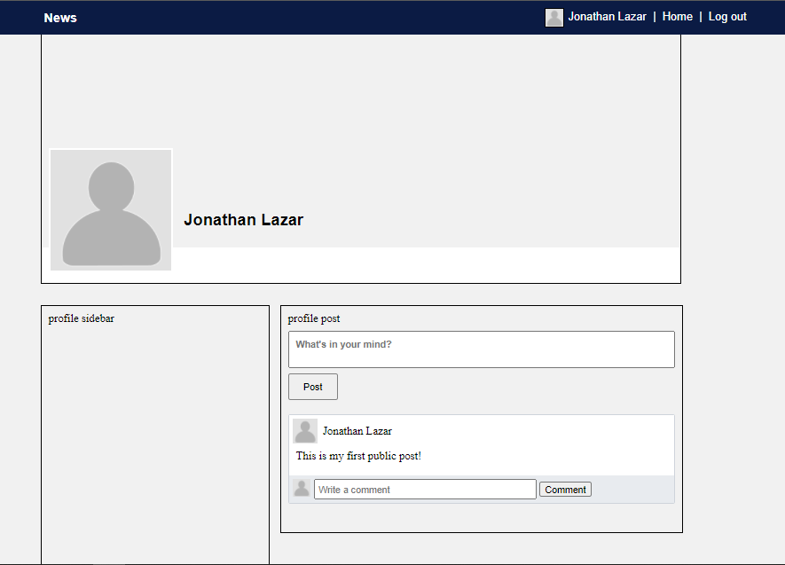
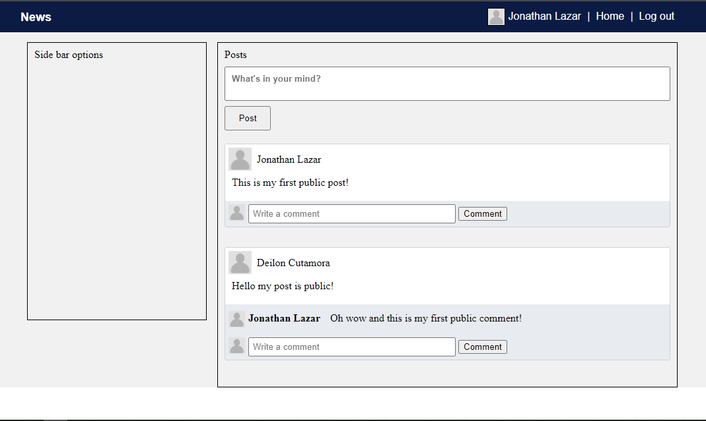

# Post/Comment System in PHP and MySQL

A simple demonstration of Relational Database in PHP and Mysql I created way back 2016.

 

 

 
 

> ## **Instruction**

* Create a database name "statusweb"
* Import statusweb.sql file
* Run xampp/wamp/lamp apache and mysql
 
 

There you go enjoy the learning experiments!

 

## Credits 

**MIT** &copy; Deilon Cutamora 